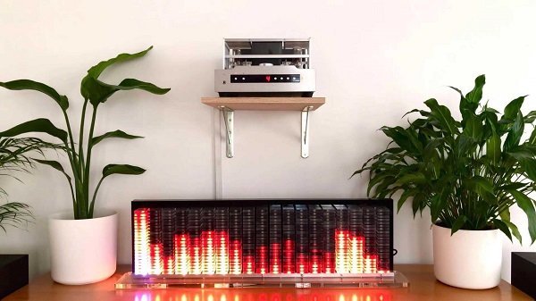

# About 🎧

This repository contains everything you need to build your own Audio Spectrum Display. Here you can find:
- [x] [FFT_Notebook](FFT_Notebook) FFT CMSIS benchamrk with comparison to scipy:
  - Sample signal generatrion,
  - Source Code of STM32CubeIDE project for STM32F4,
  - Jupyter Notebook with comparison and plots.
- [ ] [Electronics](Electronics) Analog circuit simulation and schermatic:
  - Jupyter Notebook with simulation using complex impedance models of RLC components,
  - Autodesk EAGLE schematic,
  - PCB design and gerber files for manufacturing.
- [ ] [ASD_STM32F4](ASD_STM32F4) STM32CubeIDE main controller project,
- [x] [Mechanics](Mechanics) Mechanical design of the casing:
  - Corel Draw and PDF files,
  - YouTube video about the casing assembly.

**This repo is still in development.** Check out ✅ [previous version](https://github.com/Gieneq/Audio-Spectrum-Display) of this display.

  

## TODO list
- [x] implementing FFT, display driver and animation controller on STM32F4,
- [x] designing custom PCB for preamplifier and digital circuitry, featuring:
  + TDA2822 preamplifier for FFT feed,
  + TDA2822 preamplifier for driving builtin speakers,
  + gain control using digital potentiometer,
  + VU meter,
  + ESP324C for WiFi capabilities,
  + test signal generation using AD9833,
  + bluetooth connectivity,
  + selectable signal source.
- [] test custom PCB and adapt STM32's surce code to use new features,
- [] create wiki page about preparing custom visual effects,

## STM32 HAL CubeMX sourcecode ⚙️ 
In this [directory](ASD_STM32F4) there is source code for main microcontroller. It uses builtin SAR ADC for sampling in DMA circular mode feedeing FFT buffer. SPI is used to controll 399+14 WS2812B LEDs with encoded MOSI signal. Check details on wiki page (comming soon).

## FFT evaluation and research 🔥
In this [directory](FFT_Notebook) there is shown comparison between CMSIS DSP library and Python scipy.

  

## Mechanical design 🖥️
In this [directory](Mechanics) there are all manufacturing files used to lasercut/mill the casing's parts.

  

